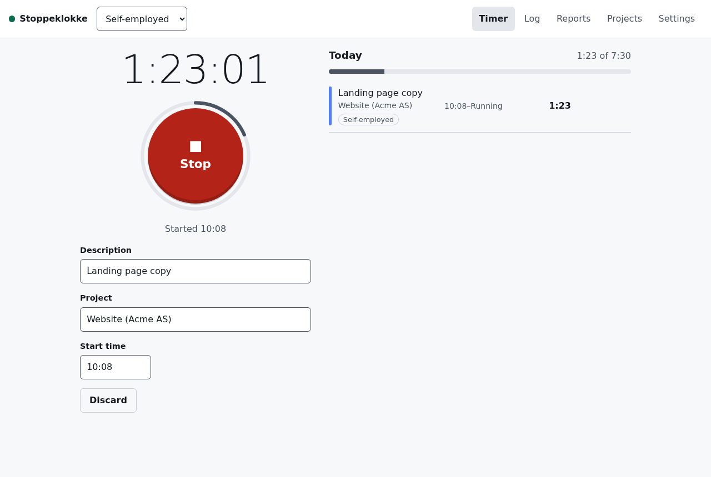

# Stoppeklokke

A small, fast time tracker for one person, running for free on Cloudflare Workers + D1. A stopwatch and a weekly log, workspaces for your different roles, optional hourly rates with inheritance, reports with CSV export, an invoice basis, period locks for invoiced time, and an installable PWA with push notifications when you have been at it for too long.

English and Norwegian Bokmål; adding a language is one JSON file.



**[User guide](docs/user-guide.md)** · [Contributing](CONTRIBUTING.md) · [Security](SECURITY.md) · [Specification](SPEC.md)

## Single-user by design

One person per instance. If several people want Stoppeklokke, each deploys their own: it takes about 15 minutes and costs nothing on Cloudflare's free plan. There is no `user_id` anywhere, and pull requests adding multiple users, teams or roles will be declined. This keeps the code small and your data in your own account.

## Features

- **Stopwatch** with in-place editing of the running entry, description autocomplete and a searchable project picker. Starting a new timer stops the old one without overlap.
- **Log**: week view, inline editing, manual entries, overlap and lock indicators.
- **Workspaces** for each role (self-employed, an employer, board work …) with their own clients, projects, rates, rounding and daily targets. Invisible until you add a second one.
- **Hourly rates** that inherit project → client → workspace → default, per currency, with rate locking so a rate change never silently rewrites invoiced history.
- **Reports**: grouping by client/project/day/week/month, per-entry rounding, amounts per currency, CSV that opens correctly in Excel and LibreOffice.
- **Invoice basis** for writing an invoice elsewhere, and **period locks** that freeze invoiced time.
- **PWA**: installable, works offline (start/stop are queued), push notifications with a Stop button.
- **Integrations**: personal API tokens, signed webhooks and an OpenAPI description at `/api/openapi.json`.
- **Data export/import** to back up or move to another instance.
- Passkeys only (no passwords), built to WCAG 2.2 AA, dark mode.

## Deploy your own

You need a Cloudflare account (the free plan is enough), [Bun](https://bun.sh) (version pinned in `package.json`) and Node.js ≥ 20 (wrangler runs on Node). A custom domain is optional; without one the app runs on `*.workers.dev`.

### 1. Fork and bootstrap

```sh
git clone https://github.com/<you>/stoppeklokke && cd stoppeklokke
bun install
bunx wrangler login
bun run bootstrap
```

`bootstrap` asks for a Worker name, an optional custom domain and your `SOURCE_URL`, then:

1. creates the D1 database and applies the migrations,
2. builds and deploys the Worker,
3. generates VAPID keys (Web Push) and a one-time `SETUP_TOKEN` and stores them as Worker secrets,
4. writes `.env` (git-ignored) so `bun run render-config` reuses the values,
5. prints the `/setup?token=…` link and the GitHub settings below (and can set the Variables with `gh`).

Open the setup link and register your first passkey. The [user guide](docs/user-guide.md#first-time-setup) walks through the rest.

### 2. Continuous deployment from GitHub

Every push to `main` runs CI (lint, typecheck, i18n check, tests in the Workers runtime, build, licence check). When CI is green, `deploy.yml` applies D1 migrations, deploys, and smoke-tests `/api/health` for the deployed git SHA. Set these in **Settings → Secrets and variables → Actions**:

| Name                    | Kind     | Value                                                                                                                                                                                 |
| ----------------------- | -------- | ------------------------------------------------------------------------------------------------------------------------------------------------------------------------------------- |
| `CLOUDFLARE_API_TOKEN`  | Secret   | [API token](https://dash.cloudflare.com/profile/api-tokens) with _Workers Scripts: Edit_, _D1: Edit_, _Account Settings: Read_, and _Zone → Workers Routes: Edit_ for a custom domain |
| `CLOUDFLARE_ACCOUNT_ID` | Secret   | Your account ID (printed by bootstrap)                                                                                                                                                |
| `BACKUP_PASSPHRASE`     | Secret   | Long random passphrase; enables the weekly encrypted backup                                                                                                                           |
| `ORIGIN`                | Variable | `https://stoppeklokke.example.com` (no trailing slash)                                                                                                                                |
| `RP_ID`                 | Variable | `stoppeklokke.example.com` (the host of `ORIGIN`)                                                                                                                                     |
| `D1_DATABASE_ID`        | Variable | The D1 database ID (printed by bootstrap)                                                                                                                                             |
| `WORKER_NAME`           | Variable | Optional, default `stoppeklokke`                                                                                                                                                      |
| `CUSTOM_DOMAIN`         | Variable | Optional, e.g. `stoppeklokke.example.com`                                                                                                                                             |
| `SOURCE_URL`            | Variable | Your fork's URL (see Licence)                                                                                                                                                         |

Without `CLOUDFLARE_API_TOKEN` the deploy and backup workflows skip with a notice, so forks keep a green CI. `wrangler.jsonc` is never committed: it is rendered from `wrangler.template.jsonc` and these values, so no account IDs or domains live in the repository.

The release workflow (release-please) needs **Settings → Actions → General → Allow GitHub Actions to create and approve pull requests**.

### Notes

- **Custom domain**: a Workers custom domain requires the domain's DNS zone to be on Cloudflare. Otherwise use the `*.workers.dev` address as `ORIGIN`.
- **Passkeys are bound to the domain** (`RP_ID`). Moving to another domain means registering passkeys again: export your data, deploy on the new domain, run `bun run reset-auth`, set a new `SETUP_TOKEN`, visit `/setup`, and import.
- **"Deploy to Cloudflare" button**: not offered. The button needs a committed Wrangler config and sets up its own build pipeline, while this project keeps account-specific config out of the repository and deploys from GitHub Actions. `bun run bootstrap` is the supported path.
- **Push notifications** need the VAPID secrets (bootstrap sets them; `bun run vapid` generates new ones). Without them everything else works and `/api/health` says so.

## Operations

| Task                                 | Command                                                                                                                                                                         |
| ------------------------------------ | ------------------------------------------------------------------------------------------------------------------------------------------------------------------------------- |
| Lost all passkeys and recovery codes | `bun run reset-auth`, then `wrangler secret put SETUP_TOKEN` and visit `/setup`. Time data is untouched.                                                                        |
| Check a deployment                   | `GET /api/health` → `{status, version, git_sha, config_errors}`                                                                                                                 |
| Restore a weekly backup              | Download the `d1-backup` artifact, `gpg --decrypt backup-YYYY-MM-DD.sql.gpg > backup.sql`, then `bunx wrangler d1 execute DB --remote --file backup.sql` into an empty database |
| Data export/import                   | In the app: **Settings → Your data**                                                                                                                                            |

The weekly backup workflow exports D1 and uploads it **encrypted** with `BACKUP_PASSPHRASE` (90-day retention). Artifacts can be downloaded by anyone with read access to the repository, which for a public repository means any signed-in GitHub user, so a plaintext dump is never uploaded. D1 Time Travel is available in addition.

## Development

```sh
bun install
cp .dev.vars.example .dev.vars
bun run dev            # http://localhost:8787 (local D1, passkeys work on localhost)
bun run seed           # demo data
bun run test           # vitest in the Workers runtime — never `bun test`
bun run lint && bun run typecheck && bun run i18n:check && bun run build
bun run screenshots    # regenerate docs/screenshots (needs `bun run dev`)
```

Architecture, conventions and gotchas are in [CLAUDE.md](CLAUDE.md); behaviour is specified in [SPEC.md](SPEC.md).

## Licence

[AGPL-3.0-or-later](LICENSE). The footer of every page links to the source code (`SOURCE_URL`), as AGPL §13 requires for network use. **If you run a modified version, point `SOURCE_URL` at your own repository** so your users can get the source of what they are using.
