# Stoppeklokke user guide

Stoppeklokke is a time tracker for one person: a stopwatch, a weekly log, reports with CSV export, an invoice basis, and period locks for time you have invoiced. It works in the browser and as an installed app on your phone.

The screenshots use the demo data from `bun run seed` and are regenerated with `bun run screenshots`.

- [First-time setup](#first-time-setup)
- [The timer](#the-timer)
- [The log](#the-log)
- [Projects, clients and workspaces](#projects-clients-and-workspaces)
- [Hourly rates](#hourly-rates)
- [Reports](#reports)
- [Invoice basis and locking a period](#invoice-basis-and-locking-a-period)
- [Notifications](#notifications)
- [Install on your phone and offline use](#install-on-your-phone-and-offline-use)
- [Settings](#settings)
- [Keyboard shortcuts](#keyboard-shortcuts)
- [API tokens and webhooks](#api-tokens-and-webhooks)
- [Backup, export and moving instances](#backup-export-and-moving-instances)
- [Lost access](#lost-access)

## First-time setup

Open the setup link printed by `bun run bootstrap` (`https://<your-domain>/setup?token=…`). The link works only until the first passkey is registered.

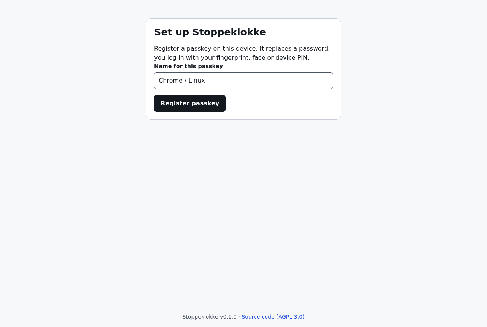

There is no password. You log in with a **passkey**: your fingerprint, face or device PIN, stored by your browser, phone or password manager.

After registering you get **ten recovery codes**. Each lets you log in once if you lose every passkey. They are shown only this one time, so store them in a password manager.

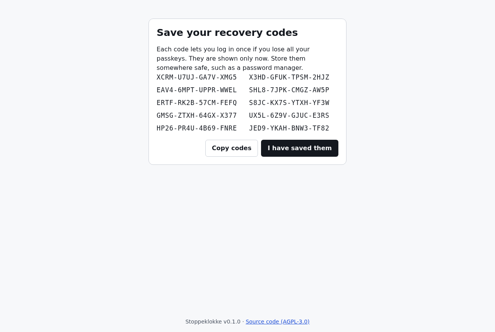

Next, a short wizard asks what to call your work (your first workspace), and for your time zone, language, currency and clock format. Stoppeklokke suggests values from your browser once. After that the stored settings always win: if you choose `Europe/Oslo` and travel, times still show in Oslo time until you change the setting.

To log in on another device, add a passkey from it (**Settings → Passkeys → Add passkey**) while logged in, or use a synced passkey from your password manager.

## The timer

The home screen is a stopwatch. Press the round button (or `s` on a keyboard) to start and stop.


- **Description**: what you are working on. Suggestions come from the last 90 days: the selected project's descriptions first, then matches at the start of a word, then anywhere. Picking a suggestion also selects the project you last used with it.
- **Project**: search projects and clients. Recently used come first. With several workspaces, the active one is listed first and the others below, so you can start a timer in another role without switching.
- While the timer runs you can change the description, the project and the **start time**. Forgot to start? Type an earlier start time.
- **Discard** throws the running time away.
- The ring around the button and the bar under **Today** show progress towards your daily target (7:30 by default).
- **Continue** on any entry starts a new timer with the same project and description.

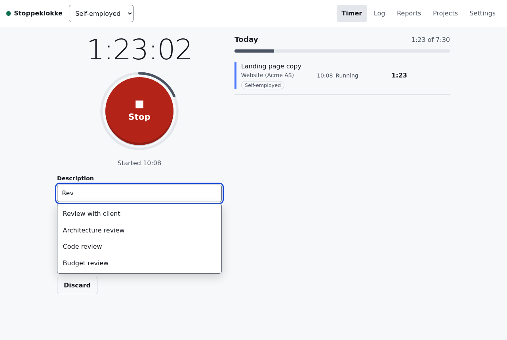

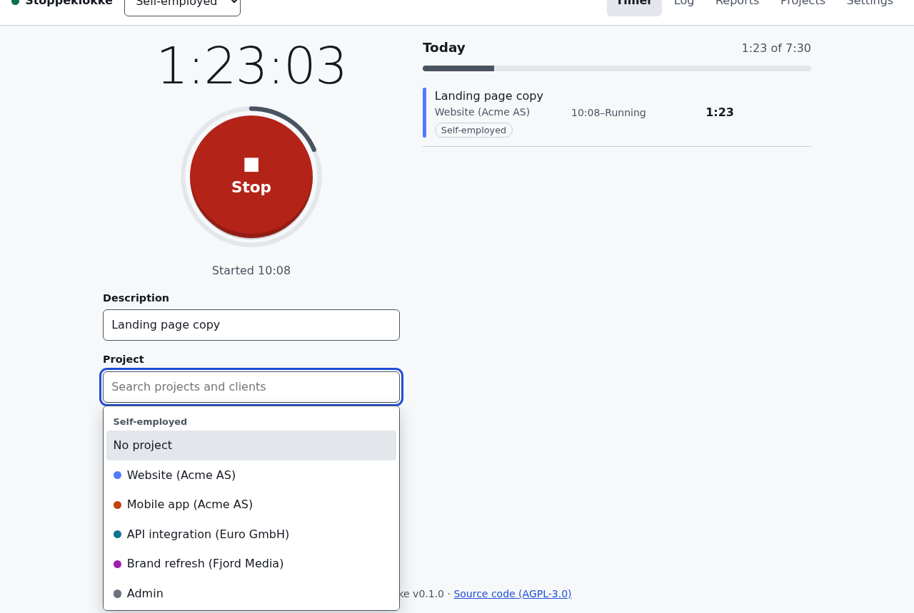

Starting a new timer while one is running stops the old one at the exact moment the new one starts, so the two never overlap. A timer that runs past midnight is never split or stopped automatically; reports split it by day. If a timer has run for more than 24 hours when you stop it, Stoppeklokke asks when you actually stopped.

## The log

The log shows one week (Monday to Sunday) with the entries for each day and day and week totals.

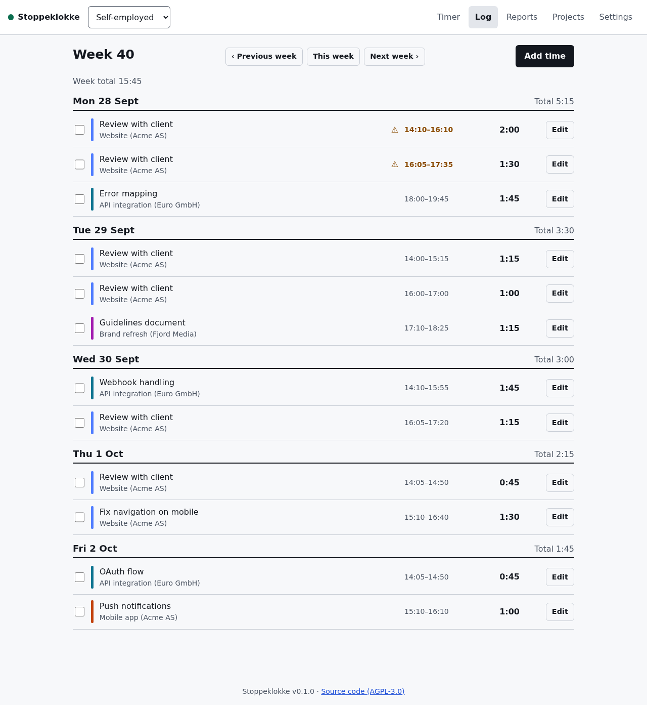

- **Add time** adds an entry by hand, with an end time or a duration (`1:30`, `1h30m`, `1,5` or `90`).
- **Edit** changes date, times, description, project and billable. An end time earlier than the start means the entry ends after midnight.
- Select several entries with the checkboxes to **lock** or **release** their hourly rate.
- Icons: 🔒 the entry is in a locked (invoiced) period and cannot be changed; ⚓ its hourly rate is locked; ⚠ it overlaps another entry. Overlaps are allowed (sometimes intentional), only flagged.

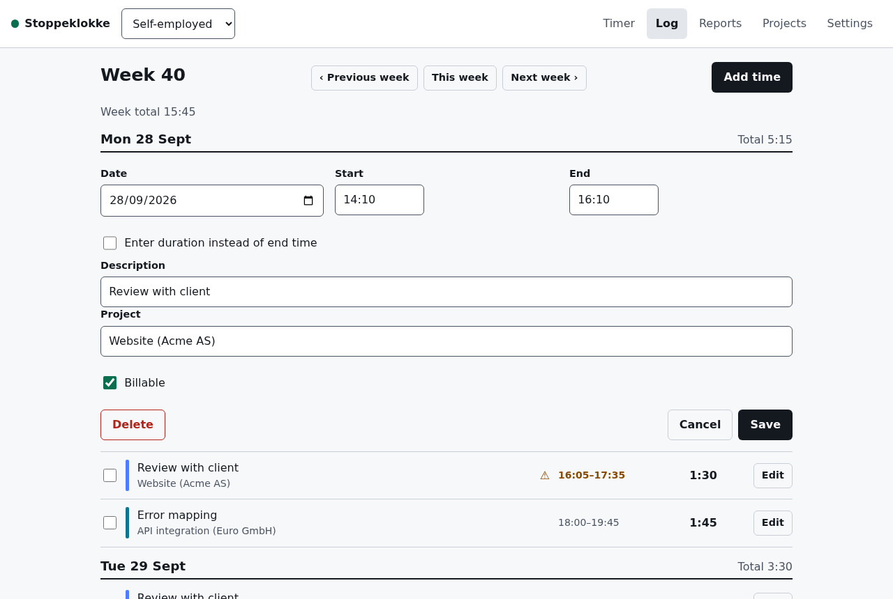

Entries cannot be more than 5 minutes in the future. Entries longer than 24 hours need a confirmation.

## Projects, clients and workspaces

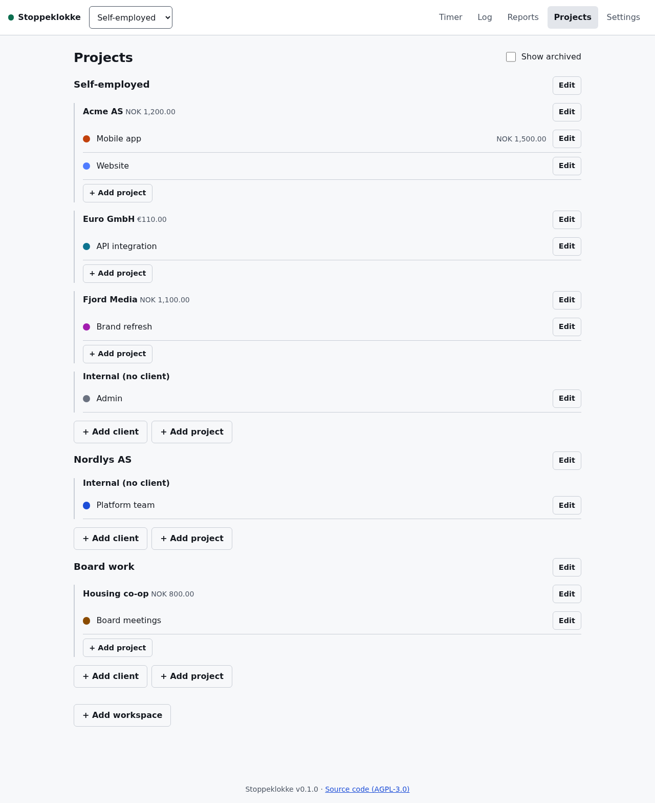

- **Clients** have projects. A project without a client is **internal** (admin, training, …).
- You can also track time against a client without a project, or against nothing at all (**Uncategorised**).
- **Archive** hides a client or project from the pickers but keeps it in reports.
- Each project has a colour and optional overrides for billable default, the long-session alert and the reminder interval.

**Workspaces** separate your roles: self-employed, an employer, board work, … Each has its own clients, projects, rates, rounding and daily target. The timer, notifications, time zone and language are shared. With a single workspace you never see any of this. Add one under **Projects → Add workspace**; a switcher then appears in the header. Moving a client to another workspace moves its projects and time with it (not possible once some of its time is locked).

## Hourly rates

Rates are optional. Each level can set one, and the most specific wins:

**project → client → workspace → default (Settings) → no rate**

The currency follows the same chain, independently. An empty rate field means _inherit_, and the field shows what would be inherited ("Inherited from client: NOK 1,200.00/h"). `0` is a real rate (pro bono). Non-billable time counts as hours but never as money. Without any rate, amounts are simply not shown.

When you change a rate (or currency) that existing time uses, Stoppeklokke asks what should happen to that time:

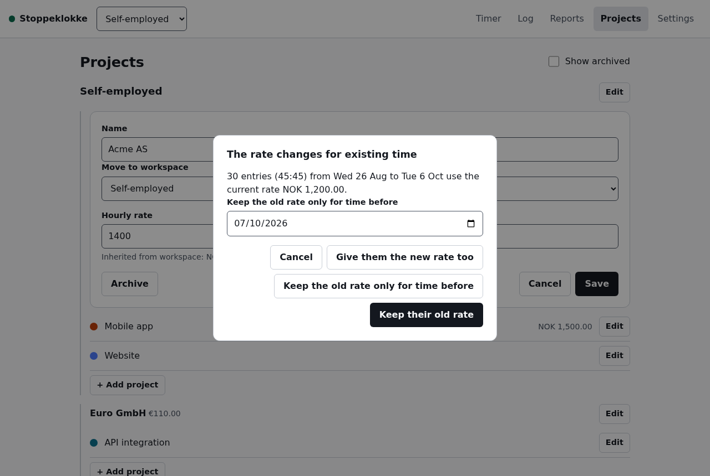

- **Keep their old rate** (default): existing time is _rate-locked_ at the old value; new time gets the new rate.
- **Keep the old rate only for time before** a date.
- **Give them the new rate too**: unlocked history is repriced.

You can choose a fixed answer under **Settings → When a rate changes**. The running timer always gets the new rate.

## Reports

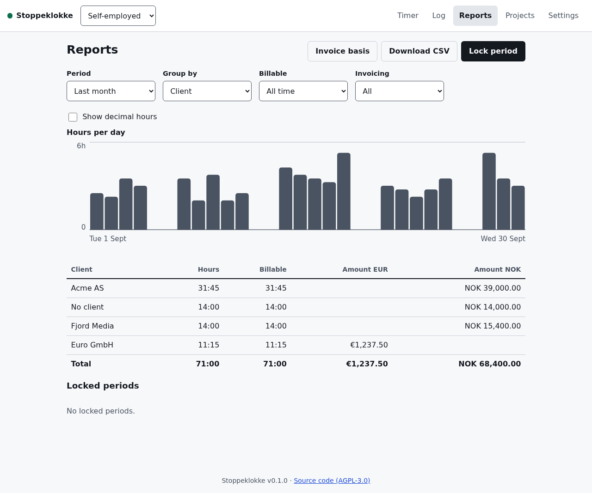

- Choose a period (this/last week, this/last month, this year or custom), a grouping (client, project, day, week, month, or workspace) and filters for billable time and invoicing status (**Not invoiced yet** shows unlocked time only).
- Hours are rounded **per entry** before summing, using the rounding in Settings (or the workspace). Your raw data never changes. Locked periods keep the rounding they were locked with.
- Amounts are totalled **per currency**. Different currencies are never added or converted.
- An entry that crosses midnight is split between the two days.
- **Download CSV** gives one line per entry. It opens directly in Excel and LibreOffice: Norwegian uses `;` and decimal comma, English uses `,` and decimal point.

## Invoice basis and locking a period

**Reports → Invoice basis** is made for writing an invoice in your invoicing system.

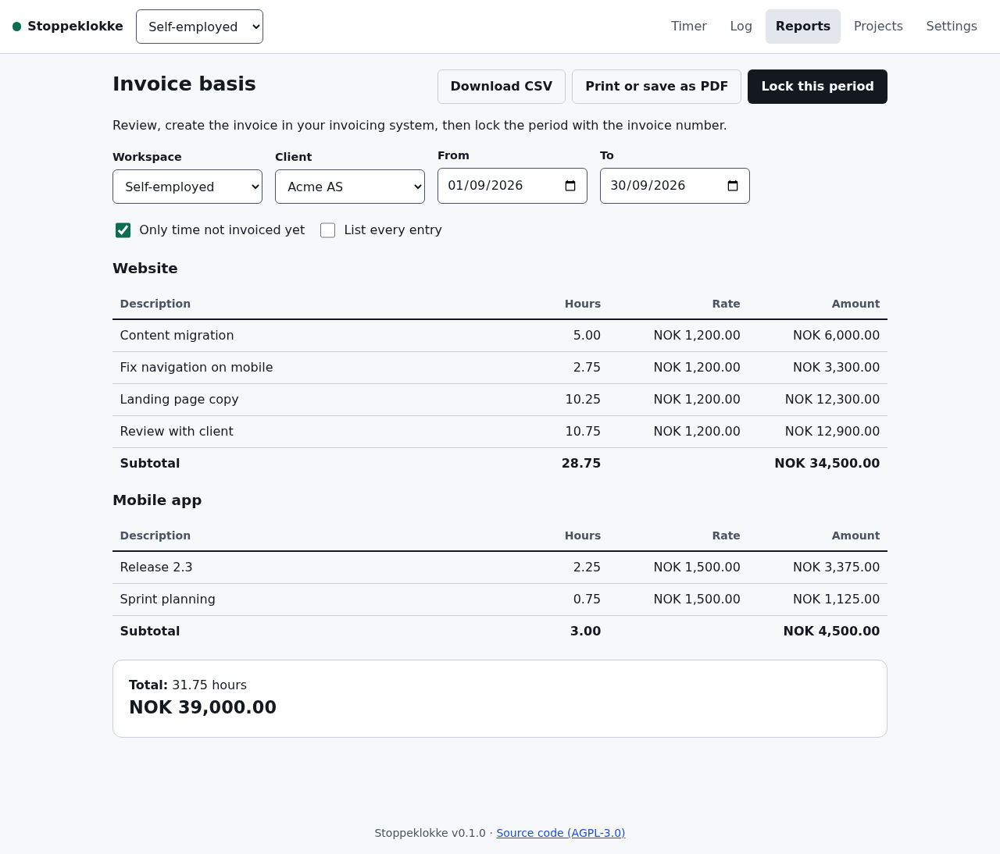

1. Choose the client and period (default: last month, time not invoiced yet).
2. Check the lines: one per project and description, with rounded hours, rate and amount, subtotals per project and totals per currency. Non-billable time is listed separately.
3. Write the invoice in your invoicing system. **Download CSV** or **Print or save as PDF** if the client wants an itemised appendix (**List every entry**).
4. **Lock this period** with the invoice number as the note.

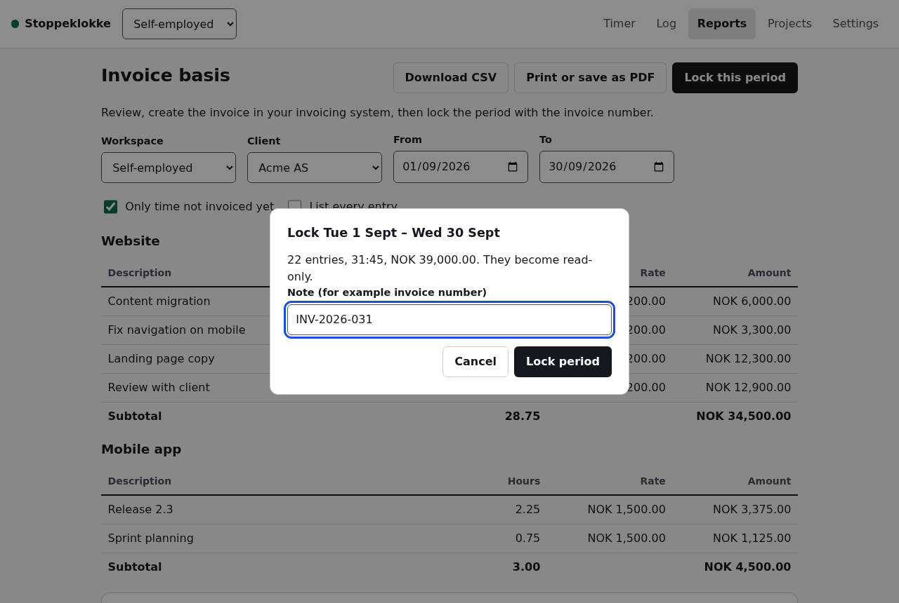

A locked period is frozen: its entries cannot be edited or deleted, no new time can be added inside it, and its rates and rounding never change afterwards. Locks are listed under **Reports → Locked periods**, and **Unlock** reverses one (you choose whether the rate locks stay). The running timer is never locked.

## Notifications

On each device, **Settings → Notifications on this device → Turn on notifications**. You then get:

- a reminder every hour while the timer runs ("Tick tock — 2:00 on Website"), except in quiet hours (23:00–07:00 by default),
- an alert after 4 hours ("You've been on Website for an unreasonably long time"), also in quiet hours.

The notification has **Stop** and **Keep going** buttons. The interval and alert time can be changed in Settings, per workspace or per project (`0` turns reminders off). Optionally, the timer can stop itself after a set time (off by default, because losing time silently is worse than one more notification).

On iPhone and iPad, notifications only work in the installed app: add Stoppeklokke to the home screen first, open it from there and log in inside it.

## Install on your phone and offline use

Stoppeklokke is a PWA. In the browser menu choose **Add to Home Screen** / **Install app**. It opens full screen like a normal app.

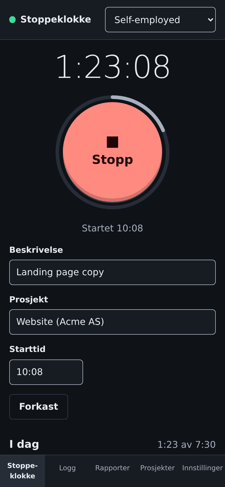

Without a connection the app still opens and shows what it last knew. You can still **start and stop the timer**: the action is saved on the device with the time you pressed the button, and synced when you are back online. If a synced action is refused (for example because the period was locked meanwhile), a message stays at the top until you dismiss it. Everything else needs a connection.

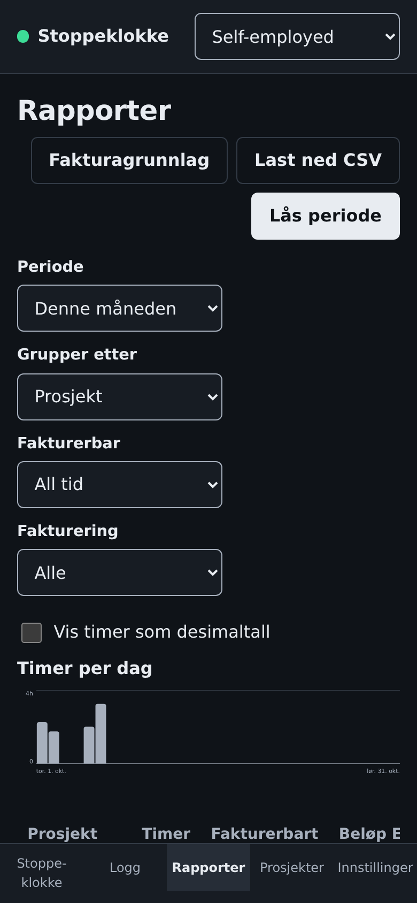

## Settings

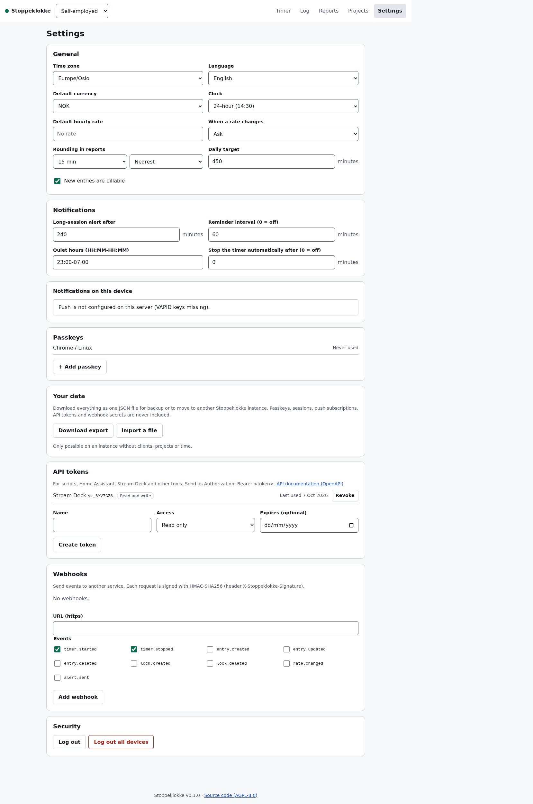

Time zone, language, currency, clock format, default rate, rounding, daily target, notifications, passkeys, API tokens, webhooks, data export/import and **Log out all devices**.

The interface is available in English and Norwegian Bokmål. Times use the 24-hour clock unless you choose 12-hour, whatever the language.

## Keyboard shortcuts

| Key   | Action                              |
| ----- | ----------------------------------- |
| `s`   | Start/stop the timer (timer screen) |
| `n`   | Add time in the log                 |
| `/`   | Search projects                     |
| `Esc` | Close the open form or dialog       |

## API tokens and webhooks

**Settings → API tokens** creates tokens for scripts and tools (Home Assistant, Stream Deck, an MCP server, …): `Authorization: Bearer sk_…`. A read-only token cannot change anything; no token can manage tokens, webhooks or passkeys. The full API is described at `/api/openapi.json`.

```sh
curl -X POST https://<your-domain>/api/timer/start \
  -H "Authorization: Bearer sk_…" -H "Content-Type: application/json" \
  -d '{"description": "Deep work"}'
```

**Settings → Webhooks** sends events (`timer.started`, `timer.stopped`, `entry.created`, …) as JSON POSTs to an https URL. Each request carries `X-Stoppeklokke-Timestamp` and `X-Stoppeklokke-Signature: sha256=<hex>`, an HMAC-SHA256 of `<timestamp>.<body>` with the secret shown when you created the webhook. Verify it before trusting the request.

## Backup, export and moving instances

**Settings → Your data → Download export** saves everything (settings, workspaces, clients, projects, locks and time) as one JSON file. Passkeys, sessions, push subscriptions, API tokens and webhook secrets are never included.

**Import a file** loads such a file into a fresh instance (one without clients, projects or time), for example after moving to another domain. Reports, locks and rates come out identical. If an import fails halfway, **Remove the partly imported data** and try again.

The operator can also run the weekly encrypted D1 backup in GitHub Actions (see the README).

## Lost access

- **Lost one device**: log in on another and delete its passkey under Settings.
- **Lost all passkeys**: use a recovery code (**Log in → Use a recovery code**). You are asked to register a new passkey straight away.
- **Lost the recovery codes too**: whoever runs the instance can run `bun run reset-auth`, set a new setup token and use `/setup` again. Your time data is not touched.
